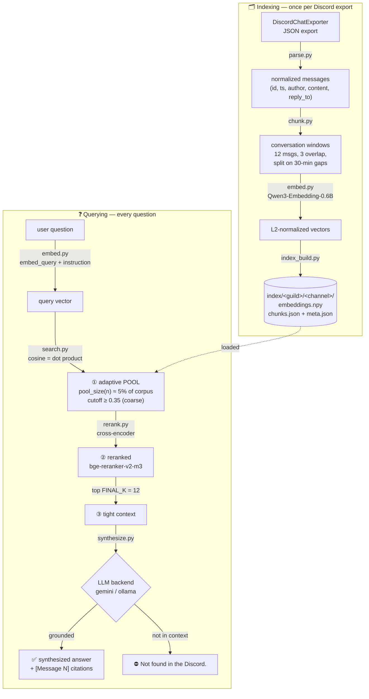
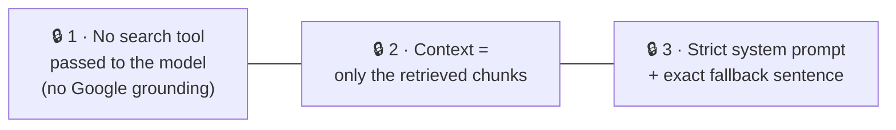
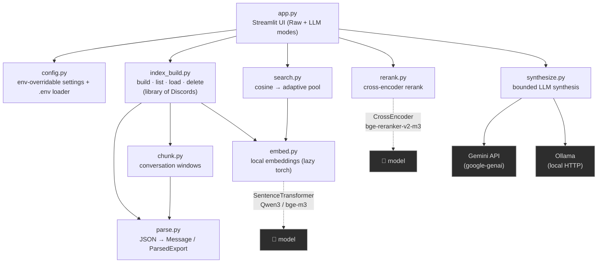

# Architecture — Discord Answerer

A bird's-eye view of the project: the RAG pipeline, the code map, and the
features shipped so far. For conventions, rationale and guardrails, see
[`CLAUDE.md`](CLAUDE.md).

> **One-line summary:** a RAG pipeline **strictly bounded** to an exported
> Discord. Ask a question → it semantically retrieves the relevant messages →
> an LLM synthesizes an answer **only** from them. If the info isn't there, the
> answer is exactly `Not found in the Discord.` — **0 web, 0 assumption.**

---

## 1. The RAG pipeline (how data flows)

Two phases share the same embedding model: **indexing** (offline, once per
Discord export) and **querying** (every question).



### The 3 anti-hallucination locks (in `synthesize.py`)

The product's core value. **Never weaken these.**



> Note: the cosine cutoff (`0.35`) is only a **coarse pre-filter** on the candidate
> pool — out-of-scope queries can still pass it (~0.46), and the cross-encoder
> reranker handles fine ranking, not rejection. **The real guard is the LLM**, held
> by the 3 locks above; the reranker improves *precision* (it does not gate answers).

### Staged retrieval — recall → precision

Retrieval is **3 independent stages**, not one `top-k` knob (the old single
`TOP_K=60` was both the candidate handle *and* the LLM context, which broke at
~57k messages — the right chunk got elbowed out by cross-channel false friends):

1. **Recall — adaptive pool** (`search.py`). Cosine returns a candidate pool
   **sized to the corpus**: `config.pool_size(n) = clamp(POOL_MIN 100,
   n·POOL_FRACTION 0.05, POOL_MAX 2000)` (≈610 at the 12k-chunk server). Scales
   with the data so the right chunk survives at large scale. The `0.35` cutoff is
   a coarse pre-filter here only.
2. **Precision — cross-encoder rerank** (`rerank.py`). A local cross-encoder
   (`BAAI/bge-reranker-v2-m3`, CUDA+fp16, mirrors `embed.py`) re-scores each
   `(query, chunk)` *jointly* — far sharper than the bi-encoder's independent
   cosine. Measured separation on the real server: **in-scope ≈ 0.95 vs
   off-topic ≈ 0.01** (despite near-identical cosine ≈ 0.35–0.65).
3. **Constant context** — the top **`FINAL_K = 12`** reranked chunks go to the
   LLM. Constant (does not grow with the corpus) → tight context, no "lost in the
   middle", strong lock.

Knobs (all `DA_*` env-overridable): `POOL_FRACTION/MIN/MAX`, `FINAL_K`,
`RERANK_ENABLED/MODEL/DEVICE`. `synthesize.py` is unchanged — the staging just
hands it a cleaner packet. Rerank load failures **fall back** to cosine order
(never crash retrieval; the precision gain is silently lost — so pin
`sentence-transformers`/`transformers` for a reproducible build).

---

## 2. Code map (who calls who)



| Module | Role | Key entry points |
|---|---|---|
| `app.py` | Streamlit UI — ingestion, library switch, Raw & LLM modes, tooltips | — |
| `config.py` | Central config, all env-overridable; loads `.env` with no dep | constants |
| `parse.py` | DiscordChatExporter JSON → normalized messages | `parse_export`, `message_link` |
| `chunk.py` | Group messages into overlapping conversation windows | `build_chunks` |
| `embed.py` | Local multilingual embeddings (lazy-imports torch) | `embed_documents`, `embed_query` |
| `index_build.py` | Build the per-channel index; group channels into servers, load & delete | `build_index`, `list_servers`, `load_server`, `load_channel`, `delete_server`, `delete_channel` |
| `search.py` | Stage 1: encode query, cosine vs. index, return the **adaptive candidate pool** | `search`, `config.pool_size` |
| `rerank.py` | Stage 2: local **cross-encoder** rerank of the pool → top `FINAL_K` (CUDA+fp16, safe fallback) | `rerank` |
| `synthesize.py` | Stage 3: bounded LLM synthesis (gemini/ollama), the 3 locks | `synthesize`, `build_prompt` |

### The index library on disk

```
index/                              # gitignored
  <guild_id>/                       # one folder per server (guild)
    <channel_id>/                   #   one subfolder per channel
      embeddings.npy                #     the vector matrix
      chunks.json                   #     aligned metadata (one row per vector)
      meta.json                     #     model, guild/channel, counters
```

A *server* = the set of channel folders under `index/<guild_id>/`. `load_server`
`np.vstack`-es the per-channel matrices (no re-embed) and tags each chunk with its
channel. `index_build.list_servers()` auto-migrates older layouts (files directly
under `index/`, or flat `index/<guild_id>_<channel_id>/`) into this nested layout
on first call.

---

## 3. Features shipped

```mermaid
mindmap
  root((Discord<br/>Answerer))
    Core RAG
      Bounded synthesis
      3 anti-hallucination locks
      "Not found" exact fallback
      [Message N] citations w/ jump-links
    Retrieval
      Local multilingual embeddings
      Cross-lingual EN/FR/KR
      Conversation-window chunking
      numpy brute-force cosine
      Adaptive candidate pool scales with corpus
      Cross-encoder rerank local precision
      Constant FINAL_K to the LLM
      Multi-channel server vstack no re-embed
      Search whole server or one channel
    UX pass non-tech
      Drag and drop multi-file upload
      Multi-server library + sidebar switch
      Channel shown on each citation
      In-UI Gemini key entry
      Hover-cards on citations
      Grouped citations Message 1, 2, 3
      Answer caching no re-billed call
      Human error messages 429 / key / Ollama
    Backends
      Gemini free tier default
      Ollama local private alt
      Trivial embed-model swap
```

**Done & validated** on a real export (Echoes of Morroc — 4434 messages → 846
chunks): raw retrieval, cross-lingual search (EN/FR/KR), Gemini synthesis with
citations, and the "Not found" lock on out-of-scope questions.

---

## 4. Next phase (noted, not yet implemented)

1. **Keep leveling up the UX/UI** beyond the non-tech pass already done.
2. **Scale to a bigger target Discord** — a semi-popular game whose knowledge
   lives on its Discord, **45k+ messages** (vs. the 4434-msg test export).
3. **Retrieval passes beyond reranking** (the staged pipeline laid the
   foundations): hybrid **BM25** + dense, per-channel **quota + MMR** for
   coverage, query **routing/decomposition**, and a cheap `rerank_score` floor to
   reject junk pools before the LLM call (the ≈0.95-vs-0.01 gap makes it
   near-zero-risk and saves an API call on out-of-scope questions).

> ⚠️ **New constraint from #2 — patch obsolescence.** The game ships regular
> patches, so old messages can describe outdated mechanics/builds. The pipeline
> will need **recency / version filtering** (time-weighting at search,
> patch-version awareness, or filtering pre-latest-patch messages). On a
> frequently-patched game, **"grounded but obsolete" is a failure mode as bad as
> hallucination.**
