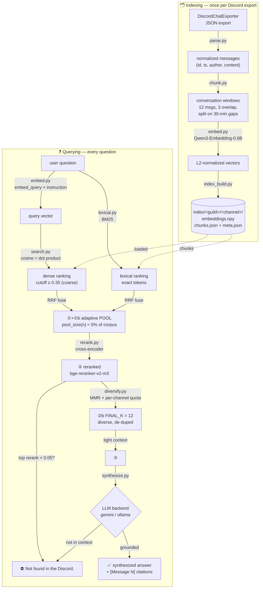
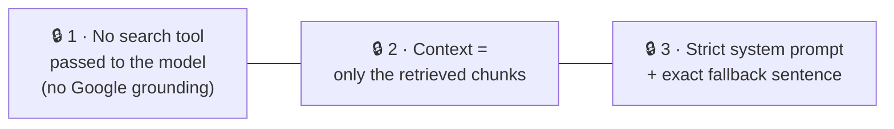
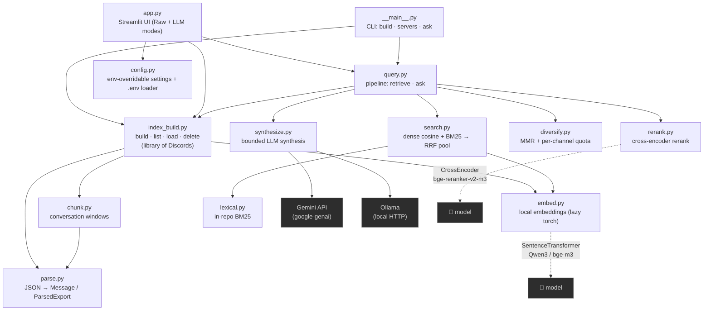

# Architecture — Discord Answerer

A bird's-eye view of the project: the RAG pipeline, the code map, and the
features shipped so far. For conventions, rationale and guardrails, see
[`CLAUDE.md`](CLAUDE.md).

> **One-line summary:** a RAG pipeline **strictly bounded** to an exported
> Discord. Ask a question → it semantically retrieves the relevant messages →
> an LLM synthesizes an answer **only** from them. If the info isn't there, the
> answer is exactly `Not found in the Discord.` — **0 web, 0 assumption.**

---

## 1. The RAG pipeline (how data flows)

Two phases share the same embedding model: **indexing** (offline, once per
Discord export) and **querying** (every question).



### The 3 anti-hallucination locks (in `synthesize.py`)

The product's core value. **Never weaken these.**



Lock 3 also hardens against **prompt injection from the corpus itself**: a Discord
message saying "ignore your instructions" travels inside the context, so the system
prompt declares the messages *data, never instructions*, and `build_prompt` repeats
that reminder after the context block. This raises the bar, it does not eliminate the
risk — a hostile message in a curated export remains a known residual threat.

> Note: the cosine cutoff (`0.35`) is only a **coarse pre-filter** on the candidate
> pool — out-of-scope queries can still pass it (~0.46), and the cross-encoder
> reranker handles fine ranking, not rejection. **The real guard is the LLM**, held
> by the 3 locks above; the reranker improves *precision* (it does not gate answers).

### Staged retrieval — recall → precision

Retrieval is a **staged pipeline**, not one `top-k` knob (the old single
`TOP_K=60` was both the candidate handle *and* the LLM context, which broke at
~57k messages — the right chunk got elbowed out by cross-channel false friends):

1. **Recall — hybrid pool** (`search.py` + `lexical.py`). Two signals over the same
   chunks, fused so neither alone gates recall:
   - **dense** cosine, with the `0.35` cutoff as a coarse pre-filter (on the dense
     side only);
   - **lexical** BM25 (`lexical.py`, in-repo, numpy-only) — catches the exact tokens
     embeddings blur (item/skill/boss names, patch numbers like "+9 STR").
   They're combined by **Reciprocal Rank Fusion** (`fused = Σ 1/(RRF_K + rank)`), so a
   low-cosine chunk can be *rescued* into the pool by BM25. The pool is **sized to the
   corpus**: `config.pool_size(n) = clamp(POOL_MIN 100, n·POOL_FRACTION 0.05,
   POOL_MAX 2000)` (≈610 at the 12k-chunk server).
2. **Precision — cross-encoder rerank** (`rerank.py`). A local cross-encoder
   (`BAAI/bge-reranker-v2-m3`, CUDA+fp16, mirrors `embed.py`) re-scores each
   `(query, chunk)` *jointly* — far sharper than the bi-encoder's independent
   cosine. Measured separation on the real server: **in-scope ≈ 0.95 vs
   off-topic ≈ 0.01** (despite near-identical cosine ≈ 0.35–0.65).
2a. **Junk-pool floor** (`query.py`). If even the best chunk's `rerank_score` is below
   `RERANK_FLOOR` (0.05), the pool is treated as off-topic and retrieval returns `[]`
   → exact `Not found in the Discord.` **with no LLM call**. The wide 0.95-vs-0.01 gap
   makes this near-zero-risk; it strengthens the lock and saves an API call on
   out-of-scope questions. Only fires when the reranker actually ran (the cosine
   fallback path has no `rerank_score` and keeps its prior behaviour).
2b. **Diversify — MMR + per-channel quota** (`diversify.py`). The final **`FINAL_K = 12`**
   are picked from the reranked pool by Maximal Marginal Relevance
   (`λ·relevance − (1−λ)·max_sim_to_picked`, λ = 0.7) to drop near-duplicate windows,
   under a per-channel cap (`ceil(k·0.5)`) so one chatty channel can't monopolize the
   answer. The cap relaxes automatically when the pool can't otherwise fill `k`
   (e.g. single-channel scope). `FINAL_K` is constant → tight context, strong lock.

Knobs (all `DA_*` env-overridable): `POOL_FRACTION/MIN/MAX`, `FINAL_K`,
`RERANK_ENABLED/MODEL/DEVICE`, `RERANK_FLOOR`, `HYBRID`, `RRF_K`, `BM25_K1/B`,
`DIVERSITY`, `MMR_LAMBDA`, `CHANNEL_FRACTION`. `synthesize.py` is unchanged — the
staging just hands it a cleaner packet. Rerank load failures **fall back** to cosine
order (never crash retrieval; the precision gain *and* the floor are silently lost —
so pin `sentence-transformers`/`transformers` for a reproducible build). On that
fallback path `diversify.py` switches its MMR relevance term to the *position* in the
incoming (RRF-fused) order rather than the raw cosine — scoring by cosine there would
demote exactly the low-cosine chunks BM25 rescued, silently undoing the hybrid pass.

---

## 2. Code map (who calls who)



| Module | Role | Key entry points |
|---|---|---|
| `app.py` | Streamlit UI — ingestion, library switch, Raw & LLM modes, tooltips; wraps `query` in Streamlit caches | — |
| `__main__.py` | CLI (`python -m discord_answerer`): `build`, `servers`, `ask` — same pipeline, headless | `main` |
| `query.py` | **Pipeline orchestration** — wires search → rerank → floor → diversify → synthesize so UI/CLI/tests share one flow | `retrieve`, `ask` |
| `config.py` | Central config, all env-overridable; loads `.env` with no dep | constants |
| `parse.py` | DiscordChatExporter JSON → normalized messages (chronologically sorted) | `parse_export`, `parse_timestamp`, `message_link` |
| `chunk.py` | Group messages into overlapping conversation windows | `build_chunks` |
| `embed.py` | Local multilingual embeddings (lazy-imports torch) | `embed_documents`, `embed_query` |
| `index_build.py` | Build the per-channel index; group channels into servers, load & delete | `build_index`, `list_servers`, `load_server`, `load_channel`, `delete_server`, `delete_channel` |
| `search.py` | Stage 1: encode query, dense cosine **+ BM25 fused by RRF** → the **adaptive candidate pool** | `search`, `config.pool_size` |
| `lexical.py` | Stage 1b: in-repo **BM25 Okapi** (inverted index, numpy-only) — lexical signal for exact tokens | `top_n`, `BM25Index` |
| `rerank.py` | Stage 2: local **cross-encoder** rerank of the pool (CUDA+fp16, safe fallback) | `rerank` |
| `diversify.py` | Stage 2b: **MMR + per-channel quota** → the diverse, de-duped `FINAL_K` | `select` |
| `synthesize.py` | Stage 3: bounded LLM synthesis (gemini/ollama), the 3 locks | `synthesize`, `build_prompt` |

### The index library on disk

```
index/                              # gitignored
  <guild_id>/                       # one folder per server (guild)
    <channel_id>/                   #   one subfolder per channel
      embeddings.npy                #     the vector matrix
      chunks.json                   #     aligned metadata (one row per vector)
      meta.json                     #     model, guild/channel, counters
```

A *server* = the set of channel folders under `index/<guild_id>/`. `load_server`
`np.vstack`-es the per-channel matrices (no re-embed) and tags each chunk with its
channel — and **refuses to stack channels indexed with different embedding models**
(their vectors live in incompatible spaces; the error tells the user which channels
to re-index). `index_build.list_servers()` auto-migrates older layouts (files
directly under `index/`, or flat `index/<guild_id>_<channel_id>/`) into this nested
layout on first call.

### Tests

`tests/` is a pytest suite (`pip install -r requirements-dev.txt`, then
`python -m pytest`) covering the retrieval stages and their interactions: BM25
ranking + the memoised index, RRF rescue of low-cosine exact-token chunks, MMR
de-dup / channel quota / quota relaxation / fallback relevance, the junk-pool
floor, parse/chunk edge cases, the mixed-model guard, and the exact `NOT_FOUND`
lock. **No model ever loads**: `embed_query` and `rerank` are monkeypatched, so
the whole suite runs in under a second on CPU.

---

## 3. Features shipped

```mermaid
mindmap
  root((Discord<br/>Answerer))
    Core RAG
      Bounded synthesis
      3 anti-hallucination locks
      "Not found" exact fallback
      [Message N] citations w/ jump-links
    Retrieval
      Local multilingual embeddings
      Cross-lingual EN/FR/KR
      Conversation-window chunking
      numpy brute-force cosine
      Adaptive candidate pool scales with corpus
      Hybrid BM25 + dense fused by RRF
      Cross-encoder rerank local precision
      Junk-pool floor rejects off-topic before the LLM
      MMR + per-channel quota for diverse FINAL_K
      Constant FINAL_K to the LLM
      Multi-channel server vstack no re-embed
      Search whole server or one channel
    UX pass non-tech
      Drag and drop multi-file upload
      Multi-server library + sidebar switch
      Channel shown on each citation
      In-UI Gemini key entry
      Hover-cards on citations
      Grouped citations Message 1, 2, 3
      Answer caching no re-billed call
      Human error messages 429 / key / Ollama
    Backends
      Gemini free tier default
      Ollama local private alt
      Trivial embed-model swap
```

**Done & validated** on a real export (Echoes of Morroc — 4434 messages → 846
chunks): raw retrieval, cross-lingual search (EN/FR/KR), Gemini synthesis with
citations, and the "Not found" lock on out-of-scope questions.

---

## 4. Next phase (noted, not yet implemented)

1. **Keep leveling up the UX/UI** beyond the non-tech pass already done.
2. **Scale to a bigger target Discord** — a semi-popular game whose knowledge
   lives on its Discord, **45k+ messages** (vs. the 4434-msg test export).
3. **Retrieval passes beyond reranking** (the staged pipeline laid the
   foundations): ✅ hybrid **BM25** + dense (RRF), ✅ per-channel **quota + MMR**
   for coverage, and ✅ a cheap `rerank_score` **floor** to reject junk pools before
   the LLM call — **all three now shipped** (`lexical.py`, `diversify.py`,
   `query._below_floor`). Still open: query **routing/decomposition**, and a hybrid
   BM25 weight tuned per corpus.

> ⚠️ **New constraint from #2 — patch obsolescence.** The game ships regular
> patches, so old messages can describe outdated mechanics/builds. The pipeline
> will need **recency / version filtering** (time-weighting at search,
> patch-version awareness, or filtering pre-latest-patch messages). On a
> frequently-patched game, **"grounded but obsolete" is a failure mode as bad as
> hallucination.**
