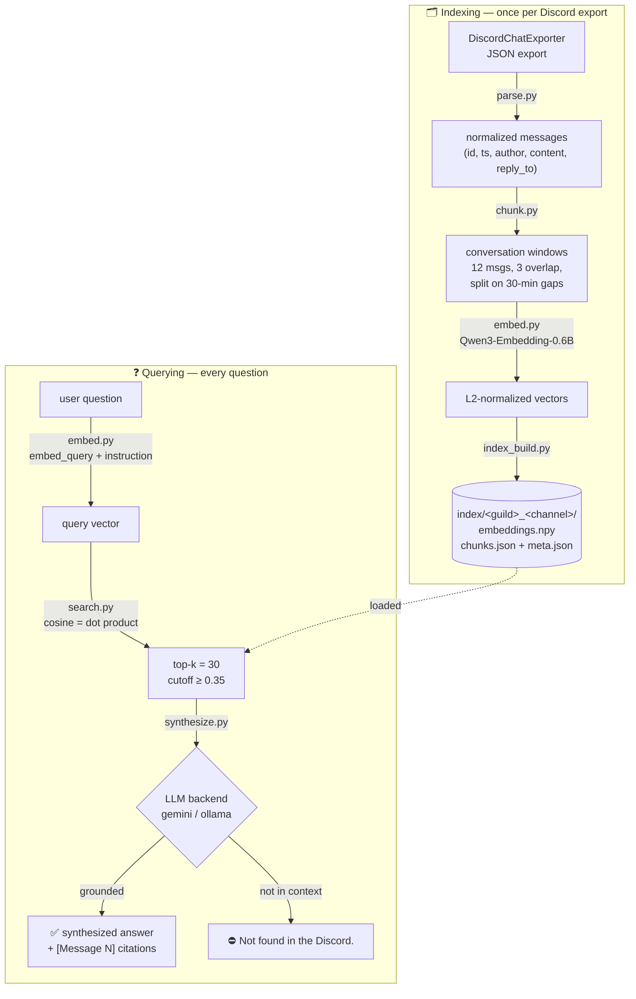
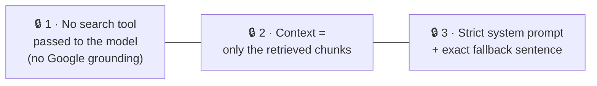
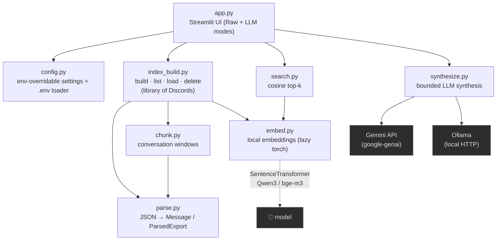

# Architecture — Discord Answerer

A bird's-eye view of the project: the RAG pipeline, the code map, and the
features shipped so far. For conventions, rationale and guardrails, see
[`CLAUDE.md`](CLAUDE.md).

> **One-line summary:** a RAG pipeline **strictly bounded** to an exported
> Discord. Ask a question → it semantically retrieves the relevant messages →
> an LLM synthesizes an answer **only** from them. If the info isn't there, the
> answer is exactly `Not found in the Discord.` — **0 web, 0 assumption.**

---

## 1. The RAG pipeline (how data flows)

Two phases share the same embedding model: **indexing** (offline, once per
Discord export) and **querying** (every question).



### The 3 anti-hallucination locks (in `synthesize.py`)

The product's core value. **Never weaken these.**



> Note: the score cutoff (`0.35`) only trims obvious noise — out-of-scope
> queries can still score ~0.46. **The real guard is the LLM**, held by the 3
> locks above.

---

## 2. Code map (who calls who)



| Module | Role | Key entry points |
|---|---|---|
| `app.py` | Streamlit UI — ingestion, library switch, Raw & LLM modes, tooltips | — |
| `config.py` | Central config, all env-overridable; loads `.env` with no dep | constants |
| `parse.py` | DiscordChatExporter JSON → normalized messages | `parse_export`, `message_link` |
| `chunk.py` | Group messages into overlapping conversation windows | `build_chunks` |
| `embed.py` | Local multilingual embeddings (lazy-imports torch) | `embed_documents`, `embed_query` |
| `index_build.py` | Build/list/load/delete the per-Discord index library | `build_index`, `list_indexes`, `load_index`, `delete_index` |
| `search.py` | Encode query, cosine vs. index, return top-k | `search` |
| `synthesize.py` | Bounded LLM synthesis (gemini/ollama), the 3 locks | `synthesize`, `build_prompt` |

### The index library on disk

```
index/                              # gitignored
  <guild_id>_<channel_id>/          # one folder per ingested Discord
    embeddings.npy                  #   the vector matrix
    chunks.json                     #   aligned metadata (one row per vector)
    meta.json                       #   model, guild/channel, counters
```

`index_build.list_indexes()` auto-migrates a legacy flat index (files directly
under `index/`) into this per-Discord layout on first call.

---

## 3. Features shipped

```mermaid
mindmap
  root((Discord<br/>Answerer))
    Core RAG
      Bounded synthesis
      3 anti-hallucination locks
      "Not found" exact fallback
      [Message N] citations w/ jump-links
    Retrieval
      Local multilingual embeddings
      Cross-lingual EN/FR/KR
      Conversation-window chunking
      numpy brute-force cosine
    UX pass non-tech
      Drag and drop upload
      Multi-Discord library + sidebar switch
      In-UI Gemini key entry
      Hover-cards on citations
      Grouped citations Message 1, 2, 3
      Answer caching no re-billed call
      Human error messages 429 / key / Ollama
    Backends
      Gemini free tier default
      Ollama local private alt
      Trivial embed-model swap
```

**Done & validated** on a real export (Echoes of Morroc — 4434 messages → 846
chunks): raw retrieval, cross-lingual search (EN/FR/KR), Gemini synthesis with
citations, and the "Not found" lock on out-of-scope questions.

---

## 4. Next phase (noted, not yet implemented)

1. **Keep leveling up the UX/UI** beyond the non-tech pass already done.
2. **Scale to a bigger target Discord** — a semi-popular game whose knowledge
   lives on its Discord, **45k+ messages** (vs. the 4434-msg test export).

> ⚠️ **New constraint from #2 — patch obsolescence.** The game ships regular
> patches, so old messages can describe outdated mechanics/builds. The pipeline
> will need **recency / version filtering** (time-weighting at search,
> patch-version awareness, or filtering pre-latest-patch messages). On a
> frequently-patched game, **"grounded but obsolete" is a failure mode as bad as
> hallucination.**
